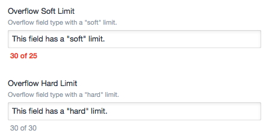

# Craft Overflow Field Type
The Overflow field type displays the number of characters entered in a field, and the total number of "recommended" characters. If the user exceeds the recommended total, the counter turns red.

Unlike the standard Craft Plain Text field type, Overflow also _enforces_ the maximum character count, allowing you to set both a "soft limit" and a "hard limit" on the field.

## Requirements
Overflow has been tested with Craft 2.1.

## Installation
1. Download and unzip the Overflow plugin.
2. Move the `overflow` directory to your `/craft/plugins` directory.
3. Go to the "Settings &rarr; Plugins" page in your admin area, and click on the "Install" button next to the Overflow plugin.

## Field Configuration
An Overflow field accepts two optional settings:

1. **Soft Limit** is the _recommended_ maximum number of characters. Setting this to a positive integer will cause Overflow to display a message beneath the field detailing the number of characters entered, and the soft limit (e.g. "21 of 25").
2. **Hard Limit** is _absolute_ maximum number of characters. Setting this to a positive integer will cause Overflow to add the `maxlength` attribute to the form field, thereby limiting the number of characters that the field will accept.

Note that whilst it is possible to make the soft limit larger than the hard limit, it makes no sense to do so.

## Support
If you've found a bug, please [create an issue][newIssue]. If you want to shower us with praise and fiscal appreciation, you can start by [finding us on Twitter][experienceTwitter].

[newIssue]: https://github.com/experience/overflow.craft/issues/new "File a bug report"
[experienceTwitter]: https://twitter.com/exphq/ "The appropriate channel for mad props"
